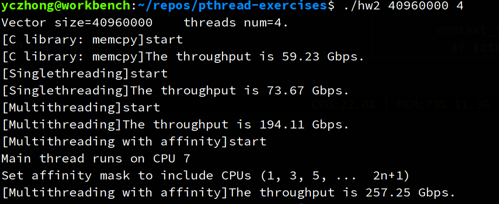

## Calculate L2 Norm

The solution is straightforward - dividing your workload into k parts. You can just use one struct for both passing parameters and receiving return values.

```cpp
typedef struct _arg {
  int low;
  int high;
  const float *vec;
  double partial_sum;
} arg_t;
```

Finally, you should observe a great speedup with multithreading.


### Common Pitfalls

1. **precision issue** (no penelty)

This is an error example. When summing float values, the type of the intermediate variable should be `double` to get an accurate result.
```cpp
const float *vec = data->vec;
float sum = 0.0f;
for (int i = data->low; i < data->high; ++i) {
    sum += vec[i] * vec[i];
}
```


2. **performance issue** (-20%)

I found some of you even got worse performance with multithreading, mostly because of an inefficient implementation of calculating L2 norm.

Here is a code snippet from one of you.
```cpp
typedef struct Result {
  double *arr2;
} result;

typedef struct _data {
  float *arr;
  int low;
  int high;
  int k;
  result resultarr;
} data_t;

void *l2_norm(void *arg) {
  data_t *data = (data_t *)(arg);
  float *arr = data->arr;
  int high = data->high;
  int low = data->low;
  int k = data->k;
  result result = data->resultarr;

  for (int i = low; i < high; i++) {
    (result.arr2)[k] += (double)arr[i] * arr[i];
  }

  return 0;
}
```

The problem here is what we call `false sharing`, which leads to performance degradation. The solution is to use an stack variable, which should be local to a thread.


## Multithreading Memcpy

The purpose of the exercise is to show how NUMA affinity has an impact on multithreading performance. Memory access across NUMA nodes introduces additional overhead. 




### Common Pitfalls

1. **Wrong implementation** (-50%)

Some of you got an astonishing throughput, e.g. >1000Gbps, which is impossible in our workbench. I checked the code and found some of you do not copy all the data, e.g. only 1/4 part of data, or only copy the same part of data. 

Another pitfall is that some of you don't wait the threads to finish, i.e., not calling `pthread_join`, making measured time inaccurate.

2. **performance issue** (-20%)

I found some of you got worse throughput with affinity, mostly because you don't bind the threads to the same NUMA node in which the main thread is. Note that the allocated memory that need to be copied should be located in the NUMA node where the main thread is.


## Race Condition Bugfix

The best solution is to use two locks - one for access the singleton instance and the other for initialization. There is no need to lock the variable `id`, since it is inside the critical section of initialization.

For the gdb debugging requirement, you only need to show that multiple threads enter the critial section.


> Bonus: Locking and unlocking also introduce somewhat overhead. There is a way to make get_instance() function more efficient. Add necessary code if you need. (+5‘)

The solution to the bonus is what we call [double-checked locking](https://en.wikipedia.org/wiki/Double-checked_locking). It is a practice when using singleton parttern.

```cpp
context_t *get_instance() {
  if (ctx == NULL) {
    pthread_mutex_lock(&lock1);
    if (ctx == NULL) {
      ctx = (context_t *)malloc(sizeof(context_t));
      assert(ctx != NULL);
      ctx->initialized = false;
    }
    pthread_mutex_unlock(&lock1);
  }

  return ctx;
}
```

### Common Pitfalls

1. **concurrency violation** (-50%)

Many of you just lock the whole part, like this
```cpp
void *do_work(void *arg) {
  pthread_mutex_lock(&lock);
  context_t *ctx = get_instance();
  if (!ctx->initialized) {
    ctx->name = (char *)arg;
    ctx->id = ++id;
    ctx->initialized = true;
  }
  pthread_mutex_unlock(&lock);
  printf("name=%s\tid=%ld\n", ctx->name, ctx->id);
  return NULL;
}
```

It is not what I expect you to do. **As I requested, `get_instance` needs to be accessible concurrently.** But in this way, it is only accessible to the thread that holds the lock. 

Another variant of this pitfall is to lock inside the `get_instance` function but unlock outside, as shown below.

```cpp
context_t *get_instance() {
  if (ctx == NULL) {
    pthread_mutex_lock(&lock);
    ctx = (context_t *)malloc(sizeof(context_t));
    assert(ctx != NULL);
    ctx->initialized = false;
  }
  return ctx;
}

void *do_work(void *arg) {
  context_t *ctx = get_instance();
  if (!ctx->initialized) {
    ctx->name = (char *)arg;
    ctx->id = ++id;
    ctx->initialized = true;
  }
  pthread_mutex_unlock(&lock);
  printf("name=%s\tid=%ld\n", ctx->name, ctx->id);
  return NULL;
}
```

It is more absurd. Apart from the above reason, when someone call `get_instance` function, he even need to do unlock himself.

2. **no lock on initialization** (-30%)

Some of you only remember to lock singleton part but forget to lock initialization part. It is necessary to do that because `ctx->initialize` is false for both threads and both may enter the critical section.

3. **use the same lock twice** (no penelty)

In this simple example, it is fine to use one lock twice. But it is better to seperate them for avoiding potential issues.

____

Note:

1. If you don't have a makefile, or have a wrong makefile (e.g. wrong name or syntax error), deduct 10 points.

2. If there is a compile error or runtime error, no point.